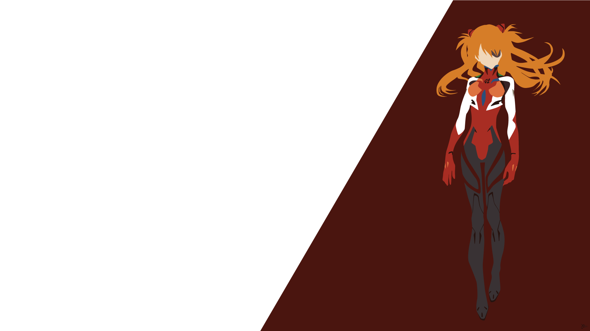

# Hi there, my name is Yevhen 👋
## Welcome to my workshop
I'm a Full-stack developer. My current technology stack is Node.js and React.js. 

<!--
**EugeneBatenko/EugeneBatenko** is a ✨ _special_ ✨ repository because its `README.md` (this file) appears on your GitHub profile.

Here are some ideas to get you started:

- 🔭 I’m currently working on ...
- 🌱 I’m currently learning ...
- 👯 I’m looking to collaborate on ...
- 🤔 I’m looking for help with ...
- 💬 Ask me about ...
- 📫 How to reach me: ...
- 😄 Pronouns: ...
- ⚡ Fun fact: ...
-->

<!--
### My contacts:

 

### Languages and technologies

<code></code>
<code></code>
<code></code>
<code></code>
<code></code>
<code></code>

-->

## 🌐 Socials:
  

## 💻 Tech Stack:
                               
## 📊 GitHub Stats:
<!--
 
 

-->

### ✍️ Random Dev Quote

---

<!-- Proudly created with GPRM ( https://gprm.itsvg.in ) -->
<!--
<code></code>
<code></code>
<code></code>
<code></code>
<code></code>
-->

